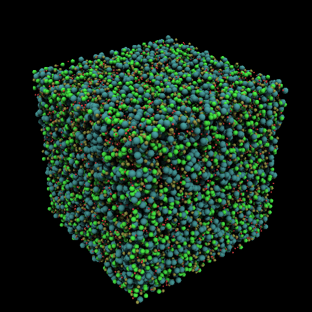

#Introduction
The code in the <i>krishna</i> branch of Galaxy implements an external simulation-to-Galaxy  many-to-many communications structure.   This is embodied in two applications: a simple parallel process, <b>ksndr</b>, that sends data (limited to particles) to a Galaxy rendering process (<b>kwrtr</b>). There is no requirement that the number of participating processes match.

In this example, one runs the two programs independently.    If <b>ksndr</b> is unable to connect to a running <b>kwrtr</b> it will say so and keep running.  If <b>kwrtr</b> is run first, it will simply wait to be contacted by <b>ksndr</b>.  

## Communications
On the Galaxy side, the communications is performed by two classes: a general socket class (subdivided into a ServerSkt class, used on the rendering side, and ClientSkt, used on the sending side), and class Receiver, which is used on the rendering side to manage the receipt of data. 

On both sides, the rank-0 process opens two sockets: one, a master socket to communicate command and control, and a data socket to send data (sending side) or receive data (rendering side). The remaining processes open at most one data socket.  

On the rendering side, the master channel is implemented with a application-installed message handler.  This enables an application to implement its own custom protocol between the simulation and the renderer.  On the rendering side, this handler (see <i>master_handler()</i> in <b>kwrtr.cpp</b>) currently uses simple string commands, of which there is currently only one ("go") which causes the Receiver instance to wait for all the data to arrive, and then render.   Note that there are other things that one might communicate over the master channel that currently are made known to <b>kwrtr</b> via command line parameters: notably the state or location of a state file so that <b>kwrtr</b> knows how to render the received data; the number of parallel sending processes, and the bounding box of the data.  All of these may be changed during a run if appropriate handling code is implemented on the rendering side.

On the sending side, the sender uses the ClientSkt class to communicate.   

##Data

Galaxy assumes that the overall data space is divided into non-overlapping regions that tile the dasta space.  The rendering side uses bounding box information (and the number of rendering processes) to come up with a rendering-side spatial partitioning scheme.

The data is transferred using a <i>very</i> simple protocol: a header describing the data, and a binary block containing the data itself.  At this time, only particle data is supported, and the binary block contains <i>n</i> 3D float points followed by <i>n</i> float data values.  This should be extended to the other types Galaxy supports.

Since there is no necessary relation between the partitioning of the data on the sending side and the partitioning of the data on the rendering side, the data received by a rendering-side process may bear no relationship to the spatial partitioned owned by the receiving rendering-side process.  Thus it is necessary to redistribute the data.   At this time, this redistribution process only handles particle data; this should be extended to handle triangle meshes, polylines as well.

Single elements of geometry can cross partition boundaries:  think about particles near a partition boundary with a radius large enough to cross the boundary.   In this case (and triangles that cross the boundary, polylines etc) the reshuffle process implements an overlap region: in the above case, the particle will need to be present on every processor that owns a parition of space that the particle's sphere will intersect.    The size of this region is given by the -f parameter of <b>kwrtr</b>.

#ksndr

<b>ksndr</b> is a parallel process that simulates a simulator.   It either generates random data or sends data from a list of input files.   It can be run multi-process under MPI.   You can tell it how many senders to use (overwritten by the length of the list of input files, if given).   It'll use threads if there aren't enough parallel processes.  If you don't tell it how many senders and there's no set of input files, it assumes one sender per each parallel process.

First timestep data is created or loaded immediately.   It then waits for input; a 's' causes it to send a timestep; a 'c' causes it to create a new timestep of random data; a 'S' does both.   'q' to quit.

If in random mode, the data associated with each particle is the <i>i/(n-1)</i> for i the rank of the sender (not MPI rank, since each MPI rank stands in for one <i>or more</i> senders; if <i>n</i> == 0 the data value is 0.

	syntax: (mpi) ksndr [options]
	options:
	    -M master                 address of master process
	    
	    -P baseport               base port: master will be here, senders start here + 1 (1900)
	    
	    -p pfile		          list of data files; can be vtp, vtu, csv, raw
									csv:
										n
										x, y, z, d
										...
									 raw: binary version of above
		
		-b xl yl zl xu yu zu       bounding box (-1 -1 -1 1 1 1)
	
		-h hostfile 	           a file containing a host name for each receiver process (localhost)
						           duplicate to create >1 process / node
  	
		-p npart     	           number of particles to send to each receiver (100)
						           in the case of randomly generated data
   
       -n nproc    	               number of senders to run (1).  if pfile is given,
                                   this is ignored and the number of data files is used
	
		-f fuzz     	           max radius of points - creates empty border region (0)
	
	
#kwrtr

<b>kwrtr</b> is the receiver and renderer.  Given a state file indicating how to render images, it waits for timestep data from a sender side, then redistributes the data into partitions as defined by the -b option and the number of processes.   It then renders it as per the state file.   

<b>kwrtr</b> can be run in any number of parallel processes. If there are more senders than receiver processes, some or all receivers will receive data from more than one senders.  If there are more receivers than senders, some won't expect data.  

The actual bounding box used by kwrtr is the given bounding box expanded by <b>fuzz</b> so that points very near the computational boundary (by <b>ksndr</b>) are not clipped.

	syntax: (mpi) kwrtr [options] state
	options:
		-P baseport             base port: master will be here, senders start here + 1 (1900)

		-f fuzz                 sort-of ghost zone width (0.0)
		
		-b xl yl zl xu yu zu    bounding box (-1 -1 -1 1 1 1)

		-n nsndrs               number of external processes sending particle data (1)

		-C cdb                  put output in Cinema DB (no)
		
		-s w h                  image width, height (1920 1080)
		
		-N                      max number of simultaneous renderings (VERY large)


#Minimal example:

##krishna.state
```
{
    "Cameras": [
        {
            "annotation": "",
            "aov": 35,
            "viewcenter": [ 0, 0, 0 ],
            "viewpoint": [ 3.0, 4.0, 3.0 ],
            "viewup": [ 0.0, 0.0, 1.0 ]
        }
    ],
    "Datasets": [
        {
            "filename": "particles.part",
            "name": "particles",
            "type": "Particles"
        }
    ],
    "Renderer": {
    	"box": [-1, 1, -1, 1, -1, 1],
    	"epsilon": 0.0001
    },
    "Visualizations": [
        {
            "annotation": "",
            "Lighting": {
                "Ka": 0.5,
                "Kd": 0.5,
                "Sources": [ [ -1, -2, -4 ] ],
                "ao count": 32,
                "ao radius": 1.0,
                "shadows": true
            },
            "operators": [
                {
                  "dataset": "particles",
                  "type": "Particles",
                  "colormap": [ [0, 1.0, 0.3, 0.3], [0.5, 0.3, 1.0, 0.3], [1, 0.3, 0.3, 1.0]],
                  "radius0": 0.01,
                  "radius1": 0.04,
                  "value0": 0,
                  "value1": 1,
                }
            ]
        }
    ]
}
```
##Single processes on each side

In one window: ```kwrtr krishna.state```
<br>
In another:  ```ksndr -f 0.1 [-h hostfile]``` followed by an 's' at the prompt.


One <b>ksndr</b> task will send a 'timestep' of ~100 points in the default box (+/- 1, +/- 1, +/- 1) and a data value of zero (the sender ID divided by the total number of senders, if not zero) to one <b>kwrtr</b> task, which will render one image as per <b>krishna.state</b>.   Since the data is constant, the spheres will take on a size of 0.1.  

We can give the sender the -h hostfile argument to tell it where to send the data.   By default, its sent to 'localhost', so this isn't necesssary here.   

We give ```ksndr``` the -f 0.1 option to prevent it from conjuring points within 0.1 of the global boundary and being cut off.   This could also be fixed by expanding the box in the state file to +/- 1.1 so that points on the +/- 1 boundary don't get cut off.

##Multiple renderers
							
In one window: ```(mpirun) kwrtr krishna.state -f 0.1```
<br>
In another:  ```ksndr [-h hostfile]``` followed by an 's' at the prompt.

One <b>ksndr</b> task will send a 'timestep' of ~100 points in the default box (+/- 1, +/- 1, +/- 1) and a data value of zero (the sender ID divided by the total number of senders, if not zero) to however many <b>kwrtr</b> tasks are started by mpirun.  One image will be rendered as per <b>krishna.state</b>.   Since the data is constant, the spheres will take on a size of 0.1.

Now we have more than one renderer, each responsible for a partition of the data space.  We therefore need to reshuffle the incoming points so that each process has access to the points that affect its partition of space.    Since the max sphere radius is 0.1, we add the <b>-f 0.1</b> option so that the data is distributed with the necessary overlap.

Again, we can give a host file to tell the sender where the renderers are.   However, it defaults so that all renderers are on 'localhost'.   Since there's a single sender, it'll send to 'localhost'.

	
##Multiple senders

In one window: ```kwrtr krishna.state -f 0.1 ```
<br>
In another:  ```(mpirun)  ksndr [-h hostfile] -n K``` followed by an 's' at the prompt.


Now K senders (determined by <b>-n K</b> argument) will send data to one renderer.   The K senders can be spread across any number of processes (less than or equal to K) which are started by mpirun.  Since there's only one renderer, the default behavoir will be for all senders to send to a single recipient at localhost.
	
##Multiple senders and renderers

In one window: ```(mpirun) kwrtr krishna.state -f 0.1 -n nsenders```
<br>
In another:  ```(mpirun)  ksndr -h hostfile -n K``` followed by an 's' at the prompt.


Now K senders (determined by -n argument) will send data to multiple renderers, as per the mpirun arguments passed when starting the renderers.   As before, the K senders can be spread across any number of processes (less than or equal to K) which are started by mpirun.  In this case, however, the senders send to multiple renderers, so they need to know how many and where they are.   We therefore need to specify the <b>-h hostfile</b> argument.  The K senders will send to the listed renderers, wrapping the list where necessary.   Note that there is an implicit port number associated with each line of the hostfile - the n'th renderer will be listening at port 1900+n on the n'th host listed.  Thus a hostfile can list the same hosts multiple times, if more than one renderer is running on the same node.

	
#Discussion

<b>ksndr</b> is patterned on what I think Krishna's code requires.  
	
Here is an image using the above krishna.state:

```mpirun -np 4 kwrtr -f 0.04 krishna.state  -n 4```

and <br>

```mpirun -np 4 ksndr -n 4 -h hosts -p 10000```


	